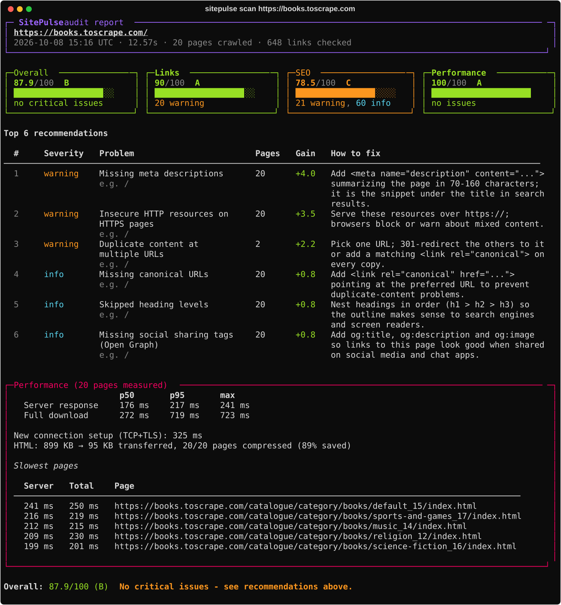
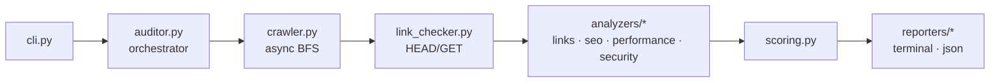

# SitePulse

[](https://github.com/afikdamri/sitepulse/actions/workflows/ci.yml)


[](https://github.com/astral-sh/ruff)
[](LICENSE)

**A fast, async command-line website auditor.** Point it at a URL and it crawls the site, finds
broken links, analyzes SEO tags, measures server response times, checks HTTP security headers -
then prints a scored report with prioritized, actionable fixes.



## Features

- **Async crawler** - breadth-first, concurrent (worker pool over `asyncio`), respects
  `robots.txt` and `Crawl-delay`, follows redirects, stays on the target site.
- **Broken links** - checks every link *and* resource (images, scripts, stylesheets), internal
  and external, with `HEAD`-then-`GET` fallback; flags redirect chains, HTTPS to HTTP downgrades
  and mixed content. Tells you which pages each broken link appears on.
- **SEO analysis** - title, meta description, headings, canonical, `noindex`, `lang`, viewport,
  image `alt`, Open Graph, plus site-wide duplicate content / title / description detection.
- **Performance** - server response time (p50/p95/max) separated from connection setup cost,
  HTML size, compression (gzip / Brotli / zstd) and the slowest pages.
- **Security headers** - HTTPS, HSTS (including the `max-age=0` trap that switches it off),
  Content-Security-Policy, clickjacking protection, `nosniff`, Referrer-Policy and server
  version disclosure. Only an allow-list of headers is recorded, so reports never contain cookies.
- **Scores and recommendations** - 0-100 per category, an overall A-F grade, and fixes ranked by
  how many points each one is worth.
- **CI-friendly** - `--fail-under` exit codes, pure JSON output (`--json -`), works without a
  TTY or UTF-8 console.

43 rules in total - see [`src/sitepulse/rules.py`](src/sitepulse/rules.py).

## Installation

Requires Python 3.12+. With [uv](https://docs.astral.sh/uv/):

```bash
uv tool install git+https://github.com/afikdamri/sitepulse
```

Or with pipx: `pipx install git+https://github.com/afikdamri/sitepulse`

## Usage

```bash
sitepulse scan example.com                        # audit up to 50 pages, 3 levels deep
sitepulse scan https://example.com --max-pages 200 --depth 5
sitepulse scan example.com --details              # every issue and every crawled page
sitepulse scan example.com --json report.json     # also save the full report
sitepulse scan example.com --json - | jq '.overall_score'
sitepulse scan staging.example.com --fail-under 85   # exit 1 if the score drops below 85
```

| Option | Default | Description |
|---|---|---|
| `--max-pages` | 50 | Maximum pages to crawl |
| `--depth` | 3 | Maximum link depth from the start page |
| `--concurrency` | 10 | Parallel requests |
| `--timeout` | 10 | Per-request timeout (seconds) |
| `--no-external` | | Skip checking links to other sites |
| `--ignore-robots` | | Crawl paths disallowed by `robots.txt` (your own site only!) |
| `--top` | 10 | Number of recommendations to show |
| `--details` | | List every issue and crawled page |
| `--json PATH` | | Write the full report as JSON (`-` for stdout) |
| `--fail-under N` | | Exit with code 1 if the overall score is below N |

**Exit codes:** `0` success · `1` score below `--fail-under` · `2` invalid input · `3` audit failed
(e.g. site unreachable).

### Use it as a quality gate in CI

```yaml
- run: uv tool install git+https://github.com/afikdamri/sitepulse
- run: sitepulse scan https://staging.example.com --fail-under 85 --json report.json
```

## How scoring works

Scores are computed **per rule, not per issue**, so a large site isn't punished for its size:

```
penalty(rule) = severity_weight x (0.5 + 0.5 x prevalence)
prevalence    = pages affected by the rule / pages analyzed      (capped at 1)
category      = max(0, 100 - sum of penalties)
overall       = 0.30 x links + 0.30 x seo + 0.20 x performance + 0.20 x security
```

Severity weights: critical 25, warning 10, info 2. Any occurrence costs at least half the weight
(one broken link is a real problem even on a 1,000-page site); prevalence scales the rest. Each
recommendation's **Gain** is the number of overall points you get back by fixing it.

## Architecture



- **Pipeline with separated concerns:** only the crawler, link checker and robots module touch
  the network. Analyzers are pure functions of the collected data; reporters only display.
- **Plugin analyzers:** each implements a small `Analyzer` protocol and returns `Issue`s with a
  stable `rule_id`, severity, recommendation and number of affected pages.
- **Dependency injection:** the HTTP client and console are passed in, which makes everything
  testable without the network.

## Engineering notes

A few things real-world testing uncovered - and how the tool handles them:

- **Measuring the server, not our own connection setup.** The first pages fetched in parallel
  looked 10x slower than the rest. Tracing showed ~1.3 s of a 1.47 s TTFB was a fresh TCP+TLS
  handshake caused by the crawler's own concurrency. SitePulse now measures connection setup via
  httpx trace events and reports *server time* separately.
- **Behaving like a real browser.** A site was reported as uncompressed - but it only served
  Brotli, which the HTTP client didn't advertise. SitePulse now sends
  `Accept-Encoding: gzip, deflate, br, zstd`, like browsers do.
- **Avoiding false positives.** External sites that block bots (HTTP 403/429/999) are reported as
  "could not verify" rather than broken; `alt=""` on decorative images is valid; `<title>` inside
  inline SVG is ignored; pages with a shared canonical aren't flagged as duplicates.
- **Portable output.** Works when output is redirected, piped or written to a legacy Windows
  console (non-UTF-8 code pages fall back to ASCII instead of crashing).

## Development

```bash
uv sync                               # create the venv and install everything
uv run pytest                         # 250+ tests, ~10 s, no internet needed
uv run pytest --cov                   # with coverage (98%)
uv run ruff check . && uv run ruff format .
uv run mypy                           # strict mode
uv run python scripts/screenshot.py   # regenerate docs/report.svg
```

The test suite includes unit tests for every module (network mocked with `respx`) and an
**end-to-end test** that serves [a local site with planted bugs](tests/fixtures/site) and
asserts SitePulse finds exactly those problems. CI runs on Linux and Windows with Python 3.12
and 3.13.

This project was built with [Claude Code](https://claude.com/claude-code) as an AI pair
programmer. [`LEARNING.md`](LEARNING.md) (Hebrew) is the stage-by-stage learning journal:
concepts, design decisions and the bugs found along the way.

## License

[MIT](LICENSE)
